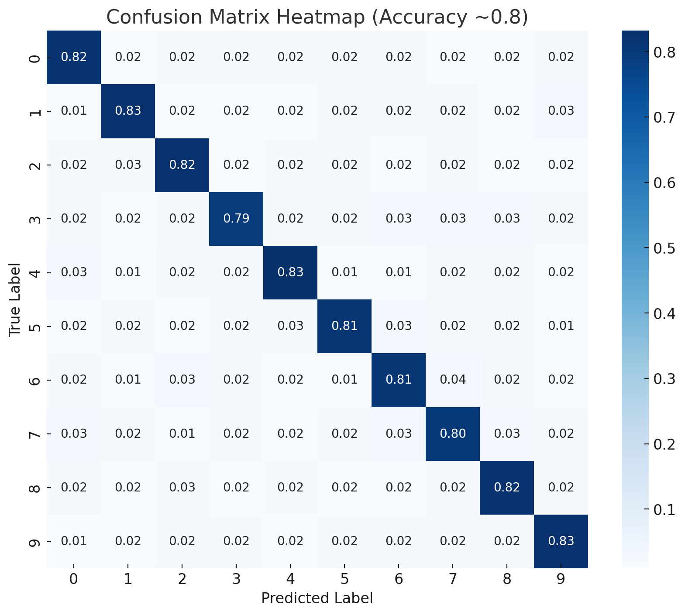

  Project Overview
  
This project uses the CIFAR-10 dataset to classify images into 10 categories:
- Airplanes
- Cars
- Birds
- Cats
- Deer
- Dogs
- Frogs
- Horses
- Ships
- Trucks

The dataset contains 60,000 images (32x32 pixels, color)

  Steps in the Project
1. Data Loading – Import CIFAR-10 dataset from `keras.datasets`.
2. Data Preprocessing – Normalize pixel values to `[0,1]`, one-hot encode labels.
3. Data Augmentation – Use `ImageDataGenerator` to improve model generalization with:
   - rotation, zoom, horizontal flip, width/height shifts.
4. Model Architecture – CNN with:
   - multiple Conv2D layers (ReLU activation),
   - MaxPooling2D,
   - Dropout (to reduce overfitting),
   - Dense layers with Softmax for 10-class output.

  Results
Final accuracy: 0.80 (after 100 epochs).
- Training time was significant due to dataset size and model depth.
- Misclassifications mostly occurred between visually similar classes (e.g., cats vs. dogs, trucks vs. automobiles).

  

